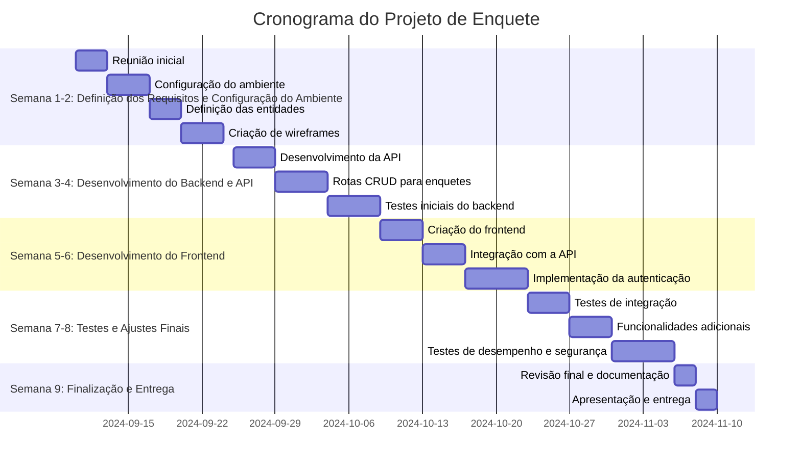
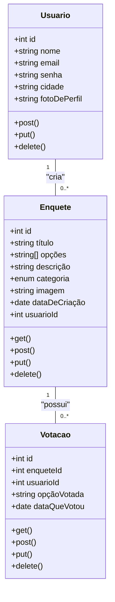

Sistema de Gestão de Produção Industrial
     O sistema visa gerenciar e monitorar o processo de produção em uma linha de montagem industrial, proporcionando controle completo sobre o fluxo de materiais, eficiência produtiva e alocação de recursos. Ele ajudará a garantir que todas as etapas do processo produtivo sejam seguidas corretamente, com um foco em maximizar o uso eficiente de máquinas e operadores, além de gerar relatórios de desempenho.

<br><br><br>

<p align="center">  </p> <p align="center">     </p> <hr> <br><br><br><br> 

Apresentação do Projeto: Sistema de Gestão de Produção Industrial
Visão Geral do Projeto
Objetivo: O sistema permitirá o controle completo da produção em uma linha de montagem, desde o cadastro de máquinas, operadores e produtos, até o monitoramento em tempo real de cada etapa do processo produtivo. Usaremos tecnologias modernas como Java, MongoDB e integrações com sensores industriais, visando uma solução robusta, escalável e eficiente.

Por que este Projeto? Este sistema foi idealizado para otimizar a eficiência operacional em indústrias de manufatura e transformação. Ele oferece visibilidade detalhada de todo o processo produtivo, permitindo ajustes em tempo real para evitar gargalos e melhorar a produtividade. O foco é fornecer uma solução que atenda desde pequenas indústrias até grandes corporações, garantindo uma operação produtiva eficiente e transparente.

<br><br><br><br><br> </a>


<br><br><br><br><br>

</a>

1. **Atrasos no Desenvolvimento: Riscos de Complexidade e Mudança de Requisitos:** O desenvolvimento de uma plataforma de enquetes interativas envolve várias funcionalidades interdependentes, como o sistema de login/cadastro, criação de enquetes, e funcionalidades de votação. O mal gerenciamento do tempo e a subestimação da complexidade técnica podem resultar em atrasos significativos, especialmente se surgirem mudanças nos requisitos ou dificuldades técnicas inesperadas, como a necessidade de ajustes em bibliotecas externas ou problemas de desempenho em consultas ao banco de dados.
   
   **Mitigação:**
Planejamento Detalhado e Metas Curto-Prazo: Defina claramente os requisitos desde o início, documentando-os de forma detalhada. Crie um cronograma com marcos bem definidos e revisões periódicas.
Gestão de Mudanças: Implemente um processo formal de controle de mudanças, onde qualquer nova solicitação de alteração deve ser discutida e aprovada antes de ser incorporada ao projeto.
Divisão do Desenvolvimento: Divida o desenvolvimento em pequenas entregas incrementais. Cada funcionalidade deve ser desenvolvida, testada e integrada em ciclos curtos.
Buffer para Imprevistos: Alocar tempo extra no cronograma para lidar com problemas técnicos ou mudanças inesperadas.
Ferramentas de Monitoramento: Utilize ferramentas de gestão de projetos, como Jira ou Trello, para acompanhar o progresso e manter o controle das tarefas.

3. **Desafios de Integração: Riscos de Inconsistência e Sincronização Entre Frontend e Backend:** A integração entre o frontend (React/Next.js) e o backend (Node.js) pode enfrentar desafios significativos, especialmente em relação ao fluxo de autenticação e à manipulação das enquetes e votos. A comunicação entre o frontend e as APIs precisa ser sincronizada de maneira eficiente, especialmente na gestão de sessões, autenticação JWT e atualização de dados em tempo real, para garantir uma experiência de usuário fluida.
   
   **Mitigação:**
Padronização de APIs: Garanta que as APIs estejam bem documentadas e sigam padrões consistentes, como o uso de REST ou GraphQL. Isso facilita a integração e a comunicação entre frontend e backend.
Testes Automatizados: Implemente testes automatizados para o frontend e o backend. Testes de integração garantirão que os endpoints da API estejam funcionando corretamente e que a comunicação com o frontend seja sincronizada.
Gestão de Sessões: Utilize um sistema de gestão de sessão robusto, como JWT com renovação automática de tokens, garantindo que a autenticação funcione corretamente e sem problemas de sincronização.
Simulações de Cenários de Uso: Execute simulações de diferentes cenários de interação entre frontend e backend para garantir que a manipulação de enquetes e votos aconteça sem inconsistências.
WebSockets ou SSE (Server-Sent Events): Para atualizações de dados em tempo real, considere usar WebSockets ou SSE, que permitem manter o frontend sincronizado com as atualizações feitas no backend.

3. **Segurança dos Dados: Vulnerabilidades em Autenticação, Proteção de Votos e Privacidade de Usuários:** A segurança dos dados é uma preocupação central em plataformas interativas. Com a funcionalidade de login/cadastro, é fundamental garantir que as senhas dos usuários sejam armazenadas com segurança, que a autenticação seja robusta (ex: usando JWT) e que as enquetes e votos sejam protegidos contra manipulação externa (como múltiplos votos fraudulentos ou ataques de injeção). Além disso, dados pessoais dos usuários, como e-mails, devem ser protegidos contra vazamentos.
   
   **Mitigação:**
Criptografia de Senhas: Armazene as senhas dos usuários utilizando algoritmos de hash seguros, como bcrypt ou Argon2, e implemente políticas de senha forte.
Autenticação Segura (JWT): Use tokens JWT com expiração curta e renovações controladas. Assegure-se de usar HTTPS para a troca segura de tokens e dados sensíveis.
Proteção contra Votos Fraudulentos: Implemente restrições para impedir múltiplos votos por usuário, como limitar um voto por IP, ou usar cookies/sessões junto ao JWT para garantir unicidade. Também é útil usar mecanismos de validação, como captchas, para evitar automação de votos.
Proteção contra Ataques de Injeção: Valide e sanitize todas as entradas de usuários para proteger a aplicação contra SQL injection e XSS. Use bibliotecas e frameworks que oferecem proteção contra essas vulnerabilidades, como o mongoose (MongoDB) e express-validator.
Anonimização de Dados: Para garantir a privacidade dos usuários, anonimize dados sensíveis nas enquetes, limitando o acesso a informações pessoais apenas para o necessário.
Auditoria e Logs: Implemente mecanismos de auditoria e logs para monitorar atividades suspeitas, como tentativas de acesso não autorizado ou votos suspeitos, e responda rapidamente a ameaças.

<br><br><br><br><br>

</a>

**Equipe:**
- 1 Gerente de Projetos
- 3 Desenvolvedores Full-Stack (Node.js, React e Next)
- 2 Designer UI/UX
- 1 Administrador de Banco de Dados
- 1 Especialista em Segurança

**Tecnologias:**
- **Node.js** (Backend)
- **React e Next** (Frontend)
- **MongoDB** (Banco de Dados)
- **JWT** (Autenticação)
- **Git/GitHub** (Controle de Versão)

**Ferramentas de Gestão:**
- Trello para gerenciamento de tarefas
- Slack para comunicação interna
- Figma para design de interfaces
- Mermaid para montagem dos diagramas

<br><br><br><br><br>

</a>


<br><br><br><br><br>

</a>
```mermaid
flowchart TD
    U[Usuário] -->|Criar Conta| A(Registrar-se)
    A -->|Fazer Login| B(Fazer Login)
    B -->|Acessar Plataforma| C(Plataforma de Enquetes)
    
    C -->|Criar Enquete| D(Criar Nova Enquete)
    D -->|Adicionar Opções| E(Adicionar Opções à Enquete)
    
    C -->|Votar em Enquete| F(Votar em Enquete Existente)
    F -->|Selecionar Opção| G(Escolher Opção e Confirmar Voto)
    
    C -->|Acompanhar Resultados| H(Visualizar Resultados das Enquetes)
    
    I[Criador da Enquete] -->|Gerenciar Enquetes| J(Gerenciar Enquetes dos Usuários)
    J -->|Editar Enquete| K(Editar Detalhes da Enquete)
    J -->|Excluir Enquete| L(Excluir Enquete)
    
    U -->|Editar Perfil| M(Atualizar Informações de Usuário)
    U -->|Excluir Conta| N(Excluir Conta)
````
<br><br><br><br><br>

</a>
````mermaid
flowchart TD
    Start([Início]) --> |Acessa Plataforma| A[Fazer Login]
    A -->|Login Sucesso| B[Dashboard de Enquetes]
    A -->|Login Falhou| C[Exibir Erro de Login]
    C -->|Tentar Novamente| A
    
    B -->|Criar Nova Enquete| D[Criar Enquete]
    D -->|Inserir Título, Opções e Descrição| E[Confirmar Criação]
    E -->|Sucesso| F[Exibir Enquete no Dashboard]
    
    B -->|Votar em Enquete| G[Selecionar Enquete]
    G -->|Escolher Opção| H[Confirmar Voto]
    H -->|Voto Registrado| I[Atualizar Resultados]
    
    B -->|Acompanhar Resultados| J[Visualizar Resultados em Tempo Real]
    
    B -->|Gerenciar Enquetes| K[Editar ou Excluir Enquete]
    K -->|Confirmar Alterações| F
    
    End([Fim])
````
<br><br><br><br><br>

</a>

<p align="left">


* ### Modelagem de Diagramas:
    - [Mermaid](https://mermaid.live/edit#pako:eNpVjs1qw0AMhF9F6NRC_AI-FBq7zSXQQnPz5iBs2bvE-8NaSwi2373r-NLqJM18M2jG1neMJfajv7eaosClVg7yvDeVjmYSS9MViuJtObGA9Y4fCxxfTh4m7UMwbnjd-eMGQTWfN4xBtHG3dbeqZ_7L8QJ1c6YgPlz_Ope7X-CjMd861_93dOSc-mx6KnsqWopQUXwieEDL0ZLp8vvzpigUzZYVlnntuKc0ikLl1oxSEv_zcC2WEhMfMPo0aMyd45SvFDoSrg0NkeyOrL_WfFuF)

* ### IA's Usadas:
    - [ChatGPT 3.5](https://chat.openai.com/)
    - [Bing - Image Creator](https://www.bing.com/images/create)
 
* ### UX/UI:
  - [Figma](https://www.figma.com/)
  
* ### Outros:
  - [YouTube](https://www.youtube.com/)
  - [Documentação](https://github.com/shyoutarou/README-Model/blob/master/README.md)
  - [Badges](https://dev.to/)
<br><br><br><br><br>
</a>

<div align=center>
  <table style="width: 100%">
    <tbody>
      <tr align=center>
        <th><strong> João Victor de Lima </br> JoaovlLima </strong></th>
      </tr>
      <tr align=center>
        <td>
          <a href="https://github.com/JoaovlLima">
            
          </a>
        </td>
      </tr>
    </tbody>

  </table>
</div>
