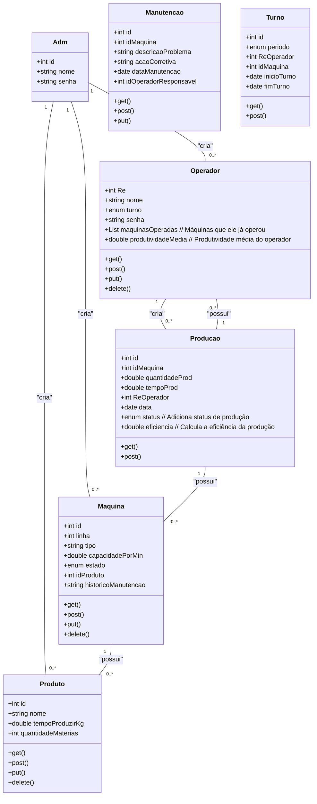

Sistema de Gestão de Produção Industrial
     O sistema visa gerenciar e monitorar o processo de produção em uma linha de montagem industrial, proporcionando controle completo sobre o fluxo de materiais, eficiência produtiva e alocação de recursos. Ele ajudará a garantir que todas as etapas do processo produtivo sejam seguidas corretamente, com um foco em maximizar o uso eficiente de máquinas e operadores, além de gerar relatórios de desempenho.

<br><br><br>

<p align="center">  </p> <p align="center">     </p> <hr> <br><br><br><br> 

Apresentação do Projeto: Sistema de Gestão de Produção Industrial
Visão Geral do Projeto
Objetivo: O sistema permitirá o controle completo da produção em uma linha de montagem, desde o cadastro de máquinas, operadores e produtos, até o monitoramento em tempo real de cada etapa do processo produtivo. Usaremos tecnologias modernas como Java, MongoDB e integrações com sensores industriais, visando uma solução robusta, escalável e eficiente.

Por que este Projeto? Este sistema foi idealizado para otimizar a eficiência operacional em indústrias de manufatura e transformação. Ele oferece visibilidade detalhada de todo o processo produtivo, permitindo ajustes em tempo real para evitar gargalos e melhorar a produtividade. O foco é fornecer uma solução que atenda desde pequenas indústrias até grandes corporações, garantindo uma operação produtiva eficiente e transparente.

<br><br><br><br><br> <br><br>

</a>

## Análise de Riscos

### 1. Riscos Técnicos

| **Risco**                                          | **Impacto** | **Probabilidade**  | **Mitigação**                                                              |
| ---------------------------------------------------| ----------- | ------------------ | -------------------------------------------------------------------------- |
| **Desempenho do MongoDB com grandes volumes**       | Alto        | Média              | Otimização de queries e testes de estresse.                                |
| **Incompatibilidade entre versões de bibliotecas**  | Médio       | Baixa              | Gerenciamento de dependências com Maven/Gradle.                            |
| **Integração futura com IoT**                       | Alto        | Média              | Arquitetura modular e uso de APIs padrão.                                  |
| **Falta de experiência com MongoDB**                | Médio       | Média              | Treinamento da equipe em NoSQL e boas práticas.                            |

### 2. Riscos de Gerenciamento

| **Risco**                                          | **Impacto** | **Probabilidade**  | **Mitigação**                                                              |
| ---------------------------------------------------| ----------- | ------------------ | -------------------------------------------------------------------------- |
| **Atrasos no cronograma**                          | Alto        | Alta               | Monitoramento regular e priorização de funcionalidades.                    |
| **Falta de comunicação clara na equipe**           | Médio       | Média              | Reuniões diárias e uso de ferramentas de gestão.                           |
| **Mudanças nos requisitos**                        | Alto        | Alta               | Controle formal de mudanças e atualização do cronograma.                   |

### 3. Riscos Operacionais

| **Risco**                                          | **Impacto** | **Probabilidade**  | **Mitigação**                                                              |
| ---------------------------------------------------| ----------- | ------------------ | -------------------------------------------------------------------------- |
| **Interrupções na produção durante a implantação**  | Alto        | Média              | Implantação em fases e treinamento antecipado.                             |
| **Resistência ao novo sistema**                    | Médio       | Alta               | Treinamentos e suporte contínuo aos operadores.                            |
| **Erros operacionais devido à complexidade da UI**  | Médio       | Média              | Desenvolvimento focado em usabilidade e testes de UX.                      |

### 4. Riscos de Segurança

| **Risco**                                          | **Impacto** | **Probabilidade**  | **Mitigação**                                                              |
| ---------------------------------------------------| ----------- | ------------------ | -------------------------------------------------------------------------- |
| **Falhas de segurança nos dados de produção**       | Alto        | Média              | Criptografia, controle de acesso e auditorias.                             |
| **Perda de dados no MongoDB**                      | Alto        | Baixa              | Backups regulares e plano de recuperação de desastres.                     |
| **Ataques cibernéticos**                           | Alto        | Baixa              | Autenticação forte, criptografia e testes de segurança.                    |

### 5. Riscos Financeiros

| **Risco**                                          | **Impacto** | **Probabilidade**  | **Mitigação**                                                              |
| ---------------------------------------------------| ----------- | ------------------ | -------------------------------------------------------------------------- |
| **Aumento de custos de desenvolvimento**           | Médio       | Alta               | Gestão rigorosa de escopo e orçamento.                                     |
| **Investimento em tecnologias sem valor imediato**  | Médio       | Média              | Foco em funcionalidades críticas e análise de retorno.                     |

### 6. Riscos Legais

| **Risco**                                          | **Impacto** | **Probabilidade**  | **Mitigação**                                                              |
| ---------------------------------------------------| ----------- | ------------------ | -------------------------------------------------------------------------- |
| **Não conformidade com regulamentos**              | Alto        | Baixa              | Revisão periódica de conformidade com normas (LGPD).                       |
| **Penalidades por falhas de compliance**           | Alto        | Baixa              | Auditorias de conformidade e correções rápidas.                            |

<br><br><br><br><br>

</a>


**Tecnologias:**
- **Java** (Front / back)
- **MongoDB** (Banco de Dados)
- **Git/GitHub** (Controle de Versão)

**Ferramentas de Gestão:**
- Slack para comunicação interna
- Figma para design de interfaces
- Mermaid para montagem dos diagramas

<br><br><br><br><br>

</a>


<br><br><br><br><br>

</a>
```mermaid
flowchart TD
    L[Tela de Login] -->|Fazer Login| A(Acessar Sistema de Produção)
    
    %% Verificação de tipo de usuário (Admin ou Operador Comum)
    A -->|Verificar Permissão| P{Usuário é Admin?}
    
    %% Permissões exclusivas do Admin
    P -->|Sim| B(Cadastro de Máquinas)
    P -->|Sim| C(Cadastro de Operadores)
    P -->|Sim| D(Cadastro de Produtos)
    
    B -->|Adicionar Detalhes| B1(Tipo, Capacidade, Estado, Histórico de Manutenção)
    C -->|Adicionar Informações| C1(Turno, Habilidades, Histórico de Produtividade)
    D -->|Especificar Produto| D1(Nome, Especificações, Materiais, Tempo de Produção)
    
    %% Funções acessíveis a todos os usuários
    P -->|Não| E(Etapas do Processo)
    E -->|Associar Máquinas e Operadores| E1(Definir Corte, Montagem, Pintura, Embalagem)
    
    A -->|Monitorar Processo Produtivo| F(Monitoramento em Tempo Real)
    F -->|Registrar Tempo| F1(Tempo Gasto em Cada Etapa)
    F -->|Visualizar Status| F2(Status de Máquinas e Operadores)
    
    A -->|Gerar Relatórios| G(Geração de Relatórios)
    G -->|Relatório de Eficiência| G1(Eficiência Produtiva, Aproveitamento, Desperdício)
    G -->|Relatório de Uso de Máquinas| G2(Horas de Operação, Tempo Ocioso, Eficiência)
    G -->|Relatório de Paradas| G3(Causas, Duração, Ações Tomadas)
    
    A -->|Gerenciar Linha de Produção| H(Interface Gráfica)
    H -->|Visualizar Status| H1(Status das Máquinas e Operadores)
    H -->|Alocar Operadores| H2(Alocação Manual ou Automática)
    H -->|Ajustar Alocação| H3(Ajuste em Tempo Real)
    H -->|Visualizar Fluxo de Produção| H4(Visualização Gráfica do Fluxo de Produção)


````
<br><br><br><br><br>

</a>
````mermaid
flowchart TD
    A[Tela de Login] -->|Fazer Login| B{Usuário Autenticado?}
    B -- Sim --> C[Acessar Sistema de Produção]
    B -- Não --> D[Mostrar Mensagem de Erro]
    
    C --> E{Escolher Ação}
    E -->|Cadastrar Máquina| F[Cadastrar Máquinas]
    E -->|Cadastrar Operador| G[Cadastrar Operadores]
    E -->|Cadastrar Produto| H[Cadastrar Produtos]
    E -->|Definir Etapas| I[Definir Etapas do Processo]
    E -->|Monitorar Produção| J[Monitorar Processo Produtivo]
    E -->|Gerar Relatórios| K[Gerar Relatórios]
    E -->|Gerenciar Linha de Produção| L[Gerenciar Linha de Produção]

    F --> M[Adicionar Detalhes da Máquina]
    G --> N[Adicionar Informações do Operador]
    H --> O[Especificar Produto]
    I --> P[Associar Máquinas e Operadores]
    
    J --> Q[Registrar Tempo em Cada Etapa]
    J --> R[Visualizar Status de Máquinas e Operadores]
    
    K --> S{Selecionar Tipo de Relatório}
    S -->|Eficiência Produtiva| T[Gerar Relatório de Eficiência]
    S -->|Uso de Máquinas| U[Gerar Relatório de Uso]
    S -->|Paradas| V[Gerar Relatório de Paradas]
    
    L --> W[Visualizar Status das Linhas de Produção]
    L --> X[Alocar Operadores]
    L --> Y[Ajustar Alocação em Tempo Real]
    L --> Z[Visualizar Fluxo de Produção]

````
<br><br><br><br><br>

</a>

<p align="left">


* ### Modelagem de Diagramas:
    - [Mermaid](https://mermaid.live/edit#pako:eNpVjs1qw0AMhF9F6NRC_AI-FBq7zSXQQnPz5iBs2bvE-8NaSwi2373r-NLqJM18M2jG1neMJfajv7eaosClVg7yvDeVjmYSS9MViuJtObGA9Y4fCxxfTh4m7UMwbnjd-eMGQTWfN4xBtHG3dbeqZ_7L8QJ1c6YgPlz_Ope7X-CjMd861_93dOSc-mx6KnsqWopQUXwieEDL0ZLp8vvzpigUzZYVlnntuKc0ikLl1oxSEv_zcC2WEhMfMPo0aMyd45SvFDoSrg0NkeyOrL_WfFuF)

* ### IA's Usadas:
    - [ChatGPT 3.5](https://chat.openai.com/)
    - [Bing - Image Creator](https://www.bing.com/images/create)
 
* ### UX/UI:
  - [Figma](https://www.figma.com/)
  
* ### Outros:
  - [YouTube](https://www.youtube.com/)
  - [Documentação](https://github.com/shyoutarou/README-Model/blob/master/README.md)
  - [Badges](https://dev.to/)
<br><br><br><br><br>
</a>

<div align=center>
  <table style="width: 100%">
    <tbody>
      <tr align=center>
        <th><strong> João Victor de Lima </br> JoaovlLima </strong></th>
      </tr>
      <tr align=center>
        <td>
          <a href="https://github.com/JoaovlLima">
            
          </a>
        </td>
      </tr>
    </tbody>

  </table>
</div>
